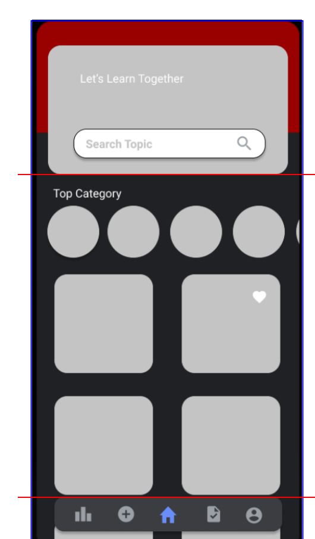

# Image-Multicropper Angular Library

A simple Angular component to allow users to split an image into multiple parts based on their input.

## Installation

To install this library, run:

npm install image-multicropper

## crop Image



## split image 


## output of split image 


## Usage
Import the ImageMulticropperModule in your Angular module:
```typescript
import { ImageMulticropperModule } from 'image-multicropper';

@NgModule({
  declarations: [AppComponent],
  imports: [ImageMulticropperModule],
  bootstrap: [AppComponent]
})
export class AppModule { }
```
Use the component in your Angular component:
```html
<lib-image-multicropper [parts]="2" [canvasWidth]="400" [canvasHeight]="851"></lib-image-multicropper>
```

## Attributes
**parts (default = 2)**: Number of segments you want to divide the image into.
**canvasWidth (default = 400)**: Width of the canvas.
**canvasHeight (default = 851)**: Height of the canvas.

## Events
onFileChange: Triggered when an image is uploaded. Opens a file dialog to select an image.
cropImage: Triggered when the crop button is clicked. It crops the image based on the segments.

## Features
Drag the lines over the uploaded image to adjust the cropping boundaries.
The image will fit within the dimensions of the canvas provided.

## Contributing
Feel free to fork, improve, make pull requests or fill issues. I'll appreciate any help and involvement.
